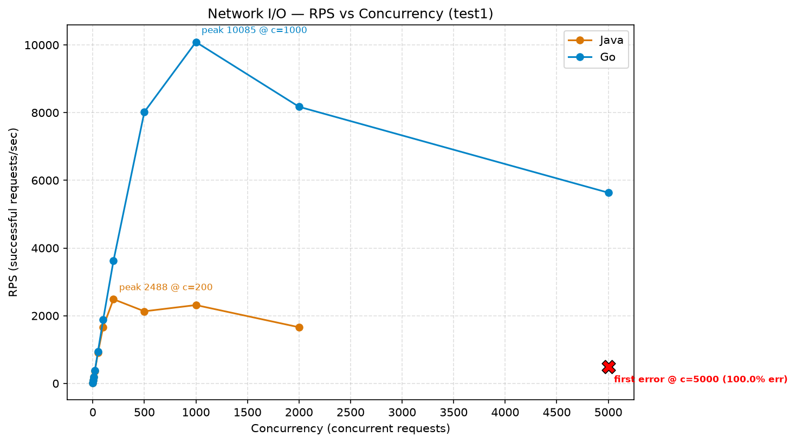
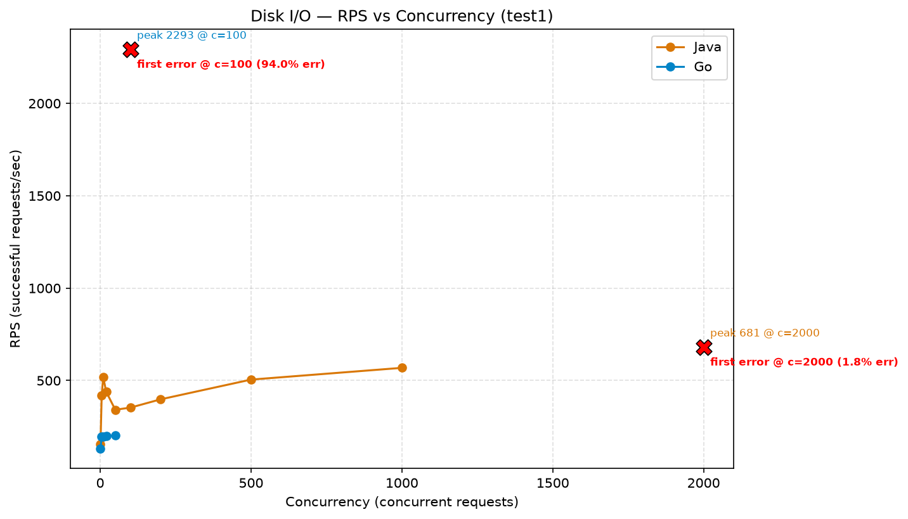

# Java (Virtual Threads) vs Go (Goroutines) Under Real Load

I compared **Java (Virtual Threads)** vs **Go (Goroutines)** under real load — and the results flipped depending on the workload.

Two identical services, same infrastructure, and the same load generator were pushed to their breaking point under two workloads: Network I/O and Disk I/O.

## Network I/O

For the **Network I/O** benchmark, with a **50 ms** delay and 1 call per request:

- Go stayed clean with zero errors all the way to concurrency **4000**, roughly **16,000** in-flight operations, before its first errors appeared at concurrency **9000**.
- Java stayed clean only up to concurrency **2000**, roughly **4,000** in-flight operations, before its first errors appeared at concurrency **3000**, roughly **6,000** in-flight operations.

**Go wins Network I/O by a 3–4x capacity margin.**

## Disk I/O

For the **Disk I/O** benchmark, with **1000** records per request:

- Java stayed clean up to concurrency **1000**, roughly **2,000** in-flight operations, with errors only creeping in gradually from concurrency **1200** onward, roughly **2,400 **in-flight operations.
- Go stayed clean only up to concurrency 60, roughly **1,200** in-flight operations, before collapsing hard at concurrency **70**, roughly **1,400** in-flight operations. The pod was OOM-killed and restarted multiple times.

**Java wins Disk I/O by a 15–17x capacity margin.**

## Why the flip?

The answer is in the type of I/O bottleneck.

### Network I/O

Network I/O has an **OS-level readiness API** such as **epoll**. Both runtimes park the task and free the thread cheaply, so the leaner Go runtime wins on overhead alone.

### Disk I/O

Disk I/O does not have such a readiness API. It is effectively a blocking syscall. Go’s scheduler compensates by spawning a new OS thread per blocked call, which spikes memory until the pod gets OOM-killed. Java’s virtual-thread scheduler, backed by ForkJoinPool, caps OS thread creation and queues excess work instead, so it degrades gracefully rather than falling off a cliff.

## Key takeaway

Which language is faster depends entirely on what kind of I/O you are bottlenecked on.

- For high-concurrency Network I/O, Go has a clear advantage.
- For blocking Disk I/O workloads, Java’s virtual threads can handle far more pressure without collapsing.

**Full methodology, load levels, and all graphs are in the detailed write-up below:**

[https://app.notion.com/p/JAVA-vs-Go-IO-heavy-testing-3d30d1fa291a80b480e0e19ae1579fe3](https://app.notion.com/p/JAVA-vs-Go-IO-heavy-testing-3d30d1fa291a80b480e0e19ae1579fe3)

**Codebase for the full experimentation:-**
[https://github.com/MBSA-INFINITY/Java-vs-Golang](https://github.com/MBSA-INFINITY/Java-vs-Golang)
