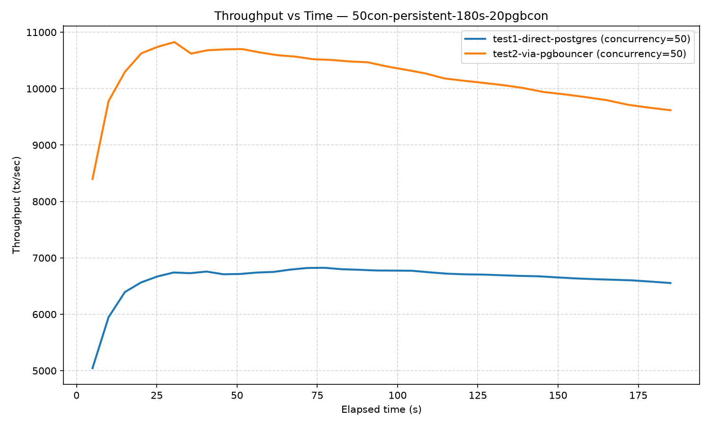
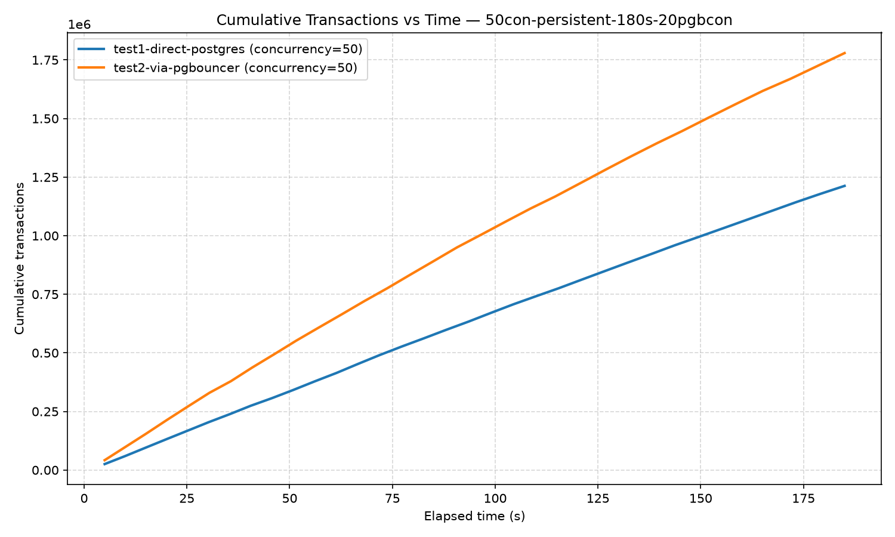
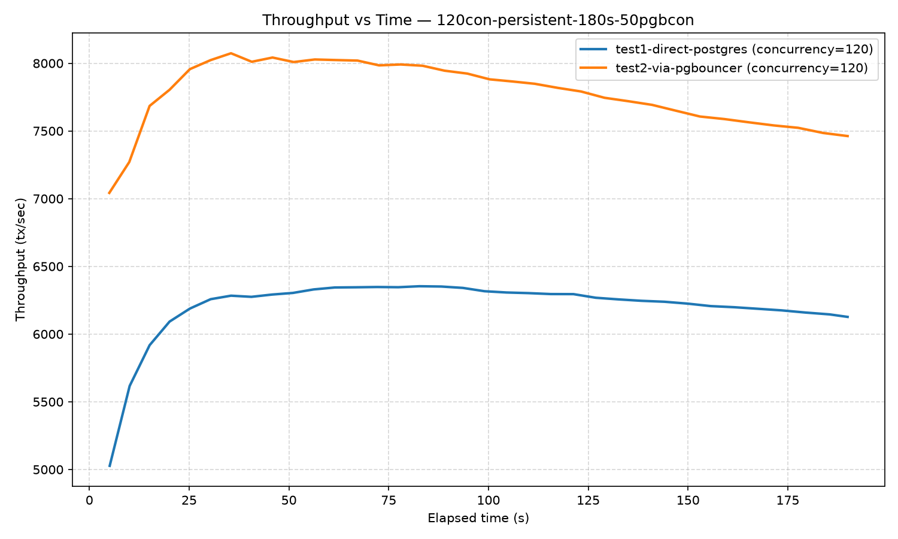
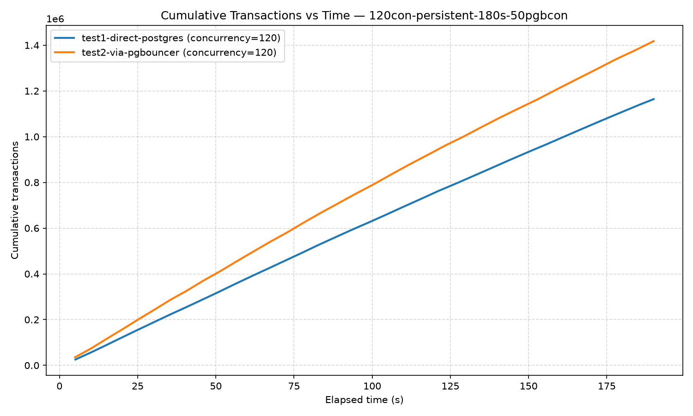

# Does PGBouncer Actually Help? A Measured Comparison Against Direct PostgreSQL Connections

## Summary

This article presents results from a controlled proof-of-concept comparing application traffic hitting PostgreSQL **directly** versus the same traffic routed through **PGBouncer**, a lightweight connection pooler. Two isolated PostgreSQL instances were deployed in Kubernetes/OKD — one dedicated to direct connections, one dedicated to sitting behind PGBouncer — removing any shared-resource confound between the two test paths. Two load levels were tested: a moderate load (50 concurrent clients) and an overload scenario (120 concurrent clients against a database capped at 100 connections).

The results are unambiguous: **PGBouncer improved throughput by 22-46%, cut p95/p99 tail latency by roughly a third to two-thirds, and eliminated connection-rejection errors entirely under overload** — all while using significantly fewer real database connections than the direct path.

## Test Setup

| Component | Configuration |
|---|---|
| Database | PostgreSQL 16, `max_connections=100`, `shared_buffers=256MB`, CPU limit: **1 core** per pod |
| Pooler | PGBouncer, `pool_mode=transaction`, `max_client_conn=2000` |
| Topology | Two fully isolated PostgreSQL instances — one for direct-connection traffic, one sitting behind PGBouncer — so neither path competes for the other's connection budget or CPU |
| Load generator | Custom Python tool, `persistent` connection mode (one connection held per worker for the whole run), `mixed` workload (~80% point-read `SELECT`, ~20% point-update `UPDATE` against a 100,000-row table) |
| Test duration | 180s steady-state per run, plus a ramp-up window |

Two scenarios were run:

- **Scenario A**: 50 concurrent workers, PGBouncer `default_pool_size=20` (real backend connections capped well below client demand)
- **Scenario B**: 120 concurrent workers (intentionally above Postgres's `max_connections=100`), PGBouncer `default_pool_size=50`

## Results

### Scenario A — 50 concurrent clients, pool size 20

| Metric | Direct → Postgres | Via PGBouncer | Difference |
|---|---:|---:|---:|
| Throughput (tps) | 6,516.23 | **9,516.92** | **+46.1%** |
| Total successful transactions (186s) | 1,212,701 | 1,779,461 | +46.7% |
| p50 latency | 3.76 ms | **3.16 ms** | 16% lower |
| p90 latency | 14.38 ms | **5.49 ms** | 62% lower |
| p95 latency | 32.96 ms | **12.69 ms** | 61% lower |
| p99 latency | 51.89 ms | **25.73 ms** | 50% lower |
| max latency | 1,027.77 ms | 1,910.32 ms | one outlier, worse |
| Connect latency (mean) | 20.91 ms → 16.15 ms* | **8.23 ms** | 49% lower |
| Connect latency (p95) | 24.46 ms | **14.82 ms** | 39% lower |
| Errors | 0 | 0 | tie |

*(Direct connection latency at 50 concurrency, well under `max_connections=100`)*

### Scenario B — 120 concurrent clients (overload), pool size 50

| Metric | Direct → Postgres | Via PGBouncer | Difference |
|---|---:|---:|---:|
| Throughput (tps) | 6,085.41 | **7,413.40** | **+21.8%** |
| Total successful transactions (191s) | 1,164,356 | 1,418,183 | +21.8% |
| p50 latency | 5.12 ms | **7.26 ms** | 42% higher (queueing cost, see analysis) |
| p90 latency | 53.01 ms | **37.05 ms** | 30% lower |
| p95 latency | 67.60 ms | **42.79 ms** | 37% lower |
| p99 latency | 82.19 ms | **56.00 ms** | 32% lower |
| max latency | 1,174.15 ms | 1,289.44 ms | one outlier, worse |
| Connect latency (mean) | 32.34 ms | **12.86 ms** | 60% lower |
| Connect latency (p95) | 84.36 ms | **33.73 ms** | 60% lower |
| **Errors** | **20** (`connect:OperationalError`) | **0** | PGBouncer fully absorbed the overload |

## Finding 1: Postgres protects itself by rejecting connections — and PGBouncer absorbs exactly what Postgres rejects

Scenario B deliberately pushed 120 concurrent workers at a Postgres instance capped at `max_connections=100`. The direct-connection test produced **exactly 20 `connect:OperationalError` failures** — precisely the excess over the connection ceiling (`120 - 100 = 20`). PostgreSQL enforces `max_connections` before allocating a backend process, so it protects itself from resource exhaustion by outright rejecting connections once the limit is hit, rather than degrading gracefully.

In our load generator, a connection failure at startup is fatal for that worker — it never retries and permanently drops out of the test. So this isn't a transient blip: the direct-connection test effectively ran the rest of its 180 seconds with only ~100 active workers instead of 120, silently losing 17% of its intended concurrency.

The PGBouncer-fronted test, hitting the exact same overload of 120 concurrent clients, recorded **zero errors**. PGBouncer's client-facing connection ceiling (`max_client_conn=2000`) absorbed all 120 client sockets, and its transaction-pooling queued the excess demand against a real backend pool of just 50 connections — well inside Postgres's 100-connection budget. No client was ever rejected; excess demand simply waited briefly in PGBouncer's queue instead of being turned away by the database.

This is the core operational argument for connection pooling: **it converts a hard failure mode (client-visible connection errors) into a soft one (slightly higher queueing latency).**

## Finding 2: PGBouncer wins on raw throughput too — even below the connection limit

Scenario A ran well under Postgres's connection ceiling (50 clients vs. a 100-connection limit), so there was no error/rejection story to tell — and PGBouncer still delivered **46% higher throughput** and roughly **half the tail latency**. This is not about avoiding failure; it's about efficiency.

Both Postgres pods in this test were capped at **1 CPU core**. Postgres is process-per-connection: each concurrently active backend competes for CPU time, and several of Postgres's internal bookkeeping structures (MVCC snapshot computation over the process array, lightweight-lock contention on shared buffers) scale with the *number of concurrently active backends*, not the amount of useful work being done. Running 50 truly concurrent backends on a single core means constant context-switching and lock contention. PGBouncer, by holding real backend concurrency to 20 and queueing the rest, keeps active concurrency closer to a level that single core can actually execute efficiently — so more transactions complete per second even though fewer are ever "in flight" against the database at once.

## Finding 3: Fewer real connections did more work — a 3.7x efficiency gain

Normalizing throughput by the number of real Postgres connections used tells a clean story about resource efficiency:

| Scenario | Path | Successful tx | Real backend connections used | Tx per real connection |
|---|---|---:|---:|---:|
| A (50 conc.) | Direct | 1,212,701 | 50 | ~24,254 |
| A (50 conc.) | Via PGBouncer | 1,779,461 | ≤20 | **~88,973** |
| B (120 conc.) | Direct | 1,164,356 | ~100 (20 rejected) | ~11,644 |
| B (120 conc.) | Via PGBouncer | 1,418,183 | ≤50 | **~28,364** |

In both scenarios, PGBouncer extracted **2.4x to 3.7x more useful work per real database connection** than the direct path — a meaningful number if database connections are a constrained/expensive resource (which, given Postgres's per-connection memory footprint, they generally are).

## Finding 4: Connection-establishment cost is dramatically and consistently lower through PGBouncer

Across both scenarios, mean connection-establishment latency was **49-60% lower** via PGBouncer:

| Scenario | Direct (mean connect) | Via PGBouncer (mean connect) | Reduction |
|---|---:|---:|---:|
| A (50 concurrency) | 16.15 ms | 8.23 ms | 49% |
| B (120 concurrency) | 32.34 ms | 12.86 ms | 60% |

Direct connections require Postgres to `fork()` a new OS process, initialize its memory context, and complete authentication for every new connection — real, non-trivial work that gets more expensive as more of it happens simultaneously (as seen in the ramp-up windows of every run). PGBouncer's client-facing accept is comparatively free (a TCP handshake plus an in-process credential check), and its own real backend connections to Postgres are opened lazily, on demand, as transactions actually arrive — spreading that expensive work over time instead of forcing it into a synchronized burst. This gap grew larger under heavier concurrency (120 vs. 50), exactly when connection-storm behavior matters most.

## Finding 5: The one place PGBouncer looked worse — p50 latency under overload

In Scenario B, PGBouncer's p50 latency (7.26ms) was actually *higher* than direct's (5.12ms). This is the visible cost of admission control: with 120 clients sharing only 50 real backend connections, a typical transaction now spends part of its time queued in PGBouncer waiting for one to free up. Direct connections never queue at this concurrency (each of the ~100 that succeeded gets its own dedicated backend), so their median transaction runs immediately — right up until the point where the *next* client can't get a connection at all and fails outright. This is the fundamental trade PGBouncer makes: a small, bounded, and configurable amount of queueing latency, in exchange for **never hard-rejecting a client**.

## Practical Takeaways

1. **PGBouncer is not just an overload safety net — it improved throughput even under normal, non-overloaded conditions**, by keeping real database concurrency closer to what the underlying hardware can execute efficiently.
2. **Under overload, PGBouncer converts hard connection failures into soft queueing delay.** In this test, the exact number of direct-connection failures matched the exact overshoot past `max_connections` — a clean, reproducible demonstration of Postgres's own admission-control behavior, and of what a pooler protects against.
3. **Pool size is a genuine tuning knob, not a "bigger is safer" setting.** A pool of 20 outperformed a pool of 50 on raw throughput in this hardware-constrained (1 CPU core) setup — right-sizing the pool to the database's actual execution capacity mattered more than maximizing it.
4. **Connection-establishment cost reduction alone is a strong, independent argument for pooling** — separate from the throughput/latency story — and it compounds under connection-storm-style load (deploys, autoscaling events, serverless cold starts).

## Appendix: Full Time-Series Data

Raw progress samples as reported by the load generator every ~5 seconds, for both tests in both scenarios.

### Scenario A — Test 1: Direct → Postgres (50 concurrency, pool n/a)

| t (s) | tx (cumulative) | tps | p50 (ms) | p95 (ms) | p99 (ms) | errors |
|---:|---:|---:|---:|---:|---:|---:|
| 5.0 | 25,342 | 5045.2 | 3.72 | 12.68 | 34.75 | 0 |
| 10.0 | 59,695 | 5949.0 | 3.75 | 27.19 | 40.10 | 0 |
| 15.1 | 96,344 | 6395.1 | 3.74 | 29.15 | 46.62 | 0 |
| 20.1 | 132,048 | 6564.5 | 3.75 | 29.78 | 45.21 | 0 |
| 25.2 | 168,034 | 6670.6 | 3.75 | 30.68 | 46.41 | 0 |
| 30.3 | 204,171 | 6741.3 | 3.75 | 31.72 | 48.40 | 0 |
| 35.4 | 238,220 | 6728.6 | 3.76 | 31.73 | 48.46 | 0 |
| 40.5 | 273,999 | 6757.7 | 3.76 | 31.51 | 47.89 | 0 |
| 45.7 | 306,723 | 6709.9 | 3.76 | 31.70 | 48.75 | 0 |
| 50.9 | 341,771 | 6714.8 | 3.77 | 32.12 | 48.95 | 0 |
| 56.1 | 378,331 | 6739.9 | 3.76 | 32.32 | 50.43 | 0 |
| 61.4 | 414,306 | 6751.5 | 3.76 | 32.65 | 50.48 | 0 |
| 66.6 | 452,550 | 6792.1 | 3.76 | 32.84 | 50.93 | 0 |
| 71.9 | 490,602 | 6821.0 | 3.75 | 32.85 | 51.38 | 0 |
| 77.3 | 527,195 | 6824.4 | 3.75 | 32.79 | 51.07 | 0 |
| 82.6 | 561,674 | 6799.0 | 3.76 | 32.82 | 51.63 | 0 |
| 88.0 | 597,703 | 6789.3 | 3.75 | 32.58 | 51.94 | 0 |
| 93.5 | 633,270 | 6776.4 | 3.75 | 32.41 | 51.72 | 0 |
| 98.9 | 670,109 | 6774.9 | 3.75 | 32.54 | 51.45 | 0 |
| 104.4 | 706,986 | 6772.3 | 3.75 | 32.73 | 51.36 | 0 |
| 109.9 | 741,413 | 6744.5 | 3.75 | 32.75 | 52.04 | 0 |
| 115.5 | 775,995 | 6720.0 | 3.76 | 32.86 | 52.03 | 0 |
| 121.0 | 812,088 | 6708.8 | 3.76 | 32.62 | 51.88 | 0 |
| 126.7 | 849,159 | 6703.8 | 3.76 | 32.69 | 51.71 | 0 |
| 132.3 | 885,428 | 6692.4 | 3.76 | 32.62 | 51.46 | 0 |
| 138.0 | 921,938 | 6681.0 | 3.76 | 32.78 | 51.42 | 0 |
| 143.7 | 959,038 | 6674.4 | 3.75 | 32.97 | 51.67 | 0 |
| 149.5 | 994,705 | 6655.1 | 3.75 | 33.14 | 51.73 | 0 |
| 155.4 | 1,031,373 | 6636.3 | 3.75 | 32.99 | 51.54 | 0 |
| 161.3 | 1,068,202 | 6622.7 | 3.75 | 33.03 | 51.39 | 0 |
| 167.2 | 1,105,313 | 6612.4 | 3.75 | 33.06 | 51.26 | 0 |
| 173.1 | 1,142,419 | 6601.5 | 3.75 | 32.88 | 51.12 | 0 |
| 179.0 | 1,177,826 | 6579.1 | 3.75 | 32.89 | 51.54 | 0 |
| 185.0 | 1,212,510 | 6554.1 | 3.76 | 32.93 | 51.81 | 0 |

### Scenario A — Test 2: Via PGBouncer (50 concurrency, pool size 20)

| t (s) | tx (cumulative) | tps | p50 (ms) | p95 (ms) | p99 (ms) | errors |
|---:|---:|---:|---:|---:|---:|---:|
| 5.0 | 42,077 | 8398.6 | 2.23 | 6.02 | 25.42 | 0 |
| 10.0 | 98,067 | 9779.7 | 2.95 | 8.87 | 26.68 | 0 |
| 15.1 | 155,278 | 10297.9 | 3.04 | 9.42 | 26.44 | 0 |
| 20.2 | 214,271 | 10626.6 | 3.06 | 9.52 | 25.94 | 0 |
| 25.3 | 271,742 | 10741.9 | 3.08 | 9.33 | 26.47 | 0 |
| 30.5 | 329,638 | 10825.3 | 3.09 | 10.24 | 26.04 | 0 |
| 35.7 | 379,028 | 10621.2 | 3.10 | 11.56 | 26.66 | 0 |
| 40.9 | 437,409 | 10682.0 | 3.10 | 11.44 | 26.53 | 0 |
| 46.3 | 494,697 | 10695.8 | 3.11 | 11.74 | 26.14 | 0 |
| 51.6 | 552,059 | 10702.4 | 3.11 | 11.87 | 25.86 | 0 |
| 57.0 | 607,090 | 10643.0 | 3.12 | 12.27 | 25.66 | 0 |
| 62.7 | 664,651 | 10592.3 | 3.12 | 12.25 | 25.75 | 0 |
| 68.2 | 721,127 | 10567.7 | 3.12 | 12.30 | 25.68 | 0 |
| 73.8 | 776,191 | 10521.5 | 3.12 | 12.36 | 25.74 | 0 |
| 79.4 | 834,120 | 10509.0 | 3.12 | 12.38 | 25.53 | 0 |
| 85.0 | 891,208 | 10482.7 | 3.12 | 12.33 | 25.80 | 0 |
| 90.7 | 949,887 | 10467.5 | 3.12 | 12.36 | 25.61 | 0 |
| 96.8 | 1,006,167 | 10392.4 | 3.12 | 12.34 | 25.86 | 0 |
| 102.7 | 1,061,451 | 10333.5 | 3.14 | 12.38 | 25.68 | 0 |
| 108.6 | 1,115,800 | 10270.9 | 3.14 | 12.52 | 25.55 | 0 |
| 114.6 | 1,167,225 | 10181.0 | 3.15 | 12.69 | 25.70 | 0 |
| 120.8 | 1,224,899 | 10139.4 | 3.15 | 12.64 | 25.87 | 0 |
| 126.9 | 1,282,023 | 10101.1 | 3.15 | 12.62 | 25.84 | 0 |
| 133.1 | 1,338,929 | 10061.3 | 3.15 | 12.68 | 25.70 | 0 |
| 139.3 | 1,394,057 | 10009.8 | 3.15 | 12.70 | 25.78 | 0 |
| 145.5 | 1,446,682 | 9940.7 | 3.15 | 12.79 | 25.89 | 0 |
| 152.0 | 1,504,492 | 9899.1 | 3.15 | 12.78 | 25.80 | 0 |
| 158.5 | 1,561,305 | 9850.7 | 3.15 | 12.74 | 25.92 | 0 |
| 165.1 | 1,617,850 | 9796.5 | 3.15 | 12.76 | 25.86 | 0 |
| 171.9 | 1,669,892 | 9713.2 | 3.16 | 12.84 | 25.85 | 0 |
| 178.8 | 1,727,587 | 9659.7 | 3.17 | 12.75 | 25.73 | 0 |
| 185.0 | 1,779,296 | 9617.8 | 3.16 | 12.67 | 25.69 | 0 |

### Scenario B — Test 1: Direct → Postgres (120 concurrency, pool n/a)

| t (s) | tx (cumulative) | tps | p50 (ms) | p95 (ms) | p99 (ms) | errors |
|---:|---:|---:|---:|---:|---:|---:|
| 5.1 | 25,455 | 5027.1 | 3.26 | 25.42 | 48.60 | 0 |
| 10.1 | 56,577 | 5616.8 | 3.93 | 48.86 | 78.99 | 20 |
| 15.1 | 89,351 | 5917.8 | 4.34 | 56.21 | 80.84 | 20 |
| 20.1 | 122,717 | 6092.2 | 4.54 | 70.41 | 81.42 | 20 |
| 25.2 | 156,242 | 6188.4 | 4.67 | 71.46 | 81.49 | 20 |
| 30.4 | 190,004 | 6257.7 | 4.75 | 71.92 | 81.66 | 20 |
| 35.5 | 222,943 | 6283.5 | 4.79 | 68.24 | 81.41 | 20 |
| 40.6 | 254,821 | 6275.0 | 4.86 | 69.84 | 81.80 | 20 |
| 45.8 | 287,989 | 6291.9 | 4.89 | 66.65 | 81.50 | 20 |
| 51.0 | 321,491 | 6303.8 | 4.91 | 64.34 | 81.29 | 20 |
| 56.2 | 355,981 | 6329.7 | 4.96 | 66.95 | 81.12 | 20 |
| 61.5 | 390,138 | 6344.1 | 4.97 | 66.29 | 80.99 | 20 |
| 66.8 | 423,674 | 6345.5 | 5.00 | 65.59 | 80.82 | 20 |
| 72.1 | 457,453 | 6347.6 | 5.00 | 65.19 | 81.24 | 20 |
| 77.4 | 491,124 | 6346.0 | 5.01 | 65.35 | 81.13 | 20 |
| 82.7 | 525,734 | 6353.3 | 5.03 | 66.33 | 81.22 | 20 |
| 88.2 | 559,995 | 6351.1 | 5.04 | 65.96 | 81.41 | 20 |
| 93.6 | 593,394 | 6340.9 | 5.04 | 66.41 | 81.42 | 20 |
| 99.0 | 625,503 | 6316.5 | 5.06 | 67.06 | 81.55 | 20 |
| 104.5 | 659,139 | 6307.1 | 5.06 | 66.41 | 81.50 | 20 |
| 110.0 | 693,511 | 6302.5 | 5.07 | 66.92 | 81.58 | 20 |
| 115.6 | 727,890 | 6295.5 | 5.08 | 67.53 | 81.49 | 20 |
| 121.3 | 763,279 | 6295.0 | 5.08 | 67.99 | 81.43 | 20 |
| 126.9 | 795,649 | 6268.2 | 5.10 | 68.36 | 81.53 | 20 |
| 132.6 | 829,611 | 6256.1 | 5.10 | 67.77 | 81.45 | 20 |
| 138.3 | 863,807 | 6245.7 | 5.10 | 67.25 | 81.47 | 20 |
| 144.1 | 898,791 | 6238.7 | 5.10 | 67.23 | 81.62 | 20 |
| 149.9 | 933,011 | 6224.9 | 5.11 | 67.63 | 81.71 | 20 |
| 155.7 | 966,395 | 6206.6 | 5.11 | 67.96 | 81.67 | 20 |
| 161.6 | 1,001,529 | 6198.3 | 5.11 | 68.02 | 81.74 | 20 |
| 167.5 | 1,036,356 | 6186.8 | 5.11 | 67.82 | 81.88 | 20 |
| 173.4 | 1,070,867 | 6175.2 | 5.11 | 67.41 | 81.87 | 20 |
| 179.4 | 1,105,239 | 6159.1 | 5.12 | 67.79 | 81.90 | 20 |
| 185.5 | 1,139,856 | 6145.3 | 5.12 | 67.69 | 81.95 | 20 |
| 190.0 | 1,164,086 | 6126.8 | 5.12 | 67.55 | 82.06 | 20 |

### Scenario B — Test 2: Via PGBouncer (120 concurrency, pool size 50)

| t (s) | tx (cumulative) | tps | p50 (ms) | p95 (ms) | p99 (ms) | errors |
|---:|---:|---:|---:|---:|---:|---:|
| 5.0 | 35,326 | 7042.5 | 2.42 | 19.71 | 34.14 | 0 |
| 10.0 | 72,966 | 7270.3 | 3.90 | 34.14 | 44.17 | 0 |
| 15.1 | 115,947 | 7684.9 | 5.80 | 39.45 | 47.71 | 0 |
| 20.1 | 157,237 | 7804.2 | 6.26 | 39.61 | 47.11 | 0 |
| 25.2 | 200,834 | 7956.6 | 6.45 | 38.92 | 46.49 | 0 |
| 30.4 | 243,656 | 8023.3 | 6.63 | 40.72 | 49.77 | 0 |
| 35.5 | 286,752 | 8073.7 | 6.71 | 41.09 | 49.66 | 0 |
| 40.7 | 326,181 | 8010.9 | 6.81 | 42.31 | 52.83 | 0 |
| 45.9 | 369,477 | 8042.2 | 6.85 | 41.65 | 52.22 | 0 |
| 51.2 | 410,068 | 8008.9 | 6.92 | 41.69 | 51.86 | 0 |
| 56.5 | 453,351 | 8027.9 | 6.96 | 41.92 | 51.46 | 0 |
| 61.8 | 496,094 | 8023.6 | 6.99 | 41.67 | 51.15 | 0 |
| 67.2 | 538,981 | 8019.7 | 7.00 | 42.46 | 53.01 | 0 |
| 72.6 | 579,615 | 7984.3 | 7.04 | 42.25 | 53.12 | 0 |
| 78.0 | 623,441 | 7990.9 | 7.05 | 42.98 | 56.46 | 0 |
| 83.5 | 666,426 | 7981.5 | 7.07 | 42.78 | 55.95 | 0 |
| 89.0 | 707,361 | 7945.1 | 7.10 | 42.65 | 55.30 | 0 |
| 94.7 | 750,156 | 7923.7 | 7.13 | 42.54 | 54.60 | 0 |
| 100.3 | 790,474 | 7881.2 | 7.16 | 42.54 | 54.79 | 0 |
| 105.9 | 833,345 | 7865.7 | 7.17 | 42.56 | 54.03 | 0 |
| 111.6 | 876,243 | 7848.4 | 7.17 | 42.50 | 53.55 | 0 |
| 117.4 | 917,775 | 7818.1 | 7.18 | 42.39 | 53.20 | 0 |
| 123.2 | 960,145 | 7791.5 | 7.18 | 42.30 | 52.98 | 0 |
| 129.1 | 999,603 | 7744.9 | 7.20 | 42.55 | 53.17 | 0 |
| 135.0 | 1,042,265 | 7719.9 | 7.21 | 42.34 | 52.88 | 0 |
| 141.0 | 1,084,378 | 7692.7 | 7.21 | 42.32 | 52.66 | 0 |
| 146.9 | 1,123,863 | 7650.1 | 7.24 | 42.56 | 53.35 | 0 |
| 153.0 | 1,164,006 | 7606.6 | 7.25 | 42.53 | 54.09 | 0 |
| 159.1 | 1,207,372 | 7587.9 | 7.25 | 42.77 | 55.60 | 0 |
| 165.3 | 1,250,434 | 7563.7 | 7.24 | 42.75 | 55.66 | 0 |
| 171.5 | 1,293,182 | 7540.8 | 7.25 | 42.62 | 55.36 | 0 |
| 177.6 | 1,336,308 | 7523.2 | 7.25 | 42.64 | 55.47 | 0 |
| 183.9 | 1,376,470 | 7485.0 | 7.26 | 42.80 | 56.07 | 0 |
| 190.0 | 1,417,842 | 7462.3 | 7.26 | 42.77 | 55.55 | 0 |

## Methodology Notes and Caveats

- Both PostgreSQL instances (direct-path and PGBouncer-path) were deployed as fully separate pods/services with identical configuration and resource limits, specifically to eliminate the shared-connection-budget confound that skewed an earlier iteration of this test (where a single shared Postgres instance made PGBouncer look artificially slower, since its own pooled connections were silently competing with the direct test for the same `max_connections` budget).
- Because the two Postgres instances are separate pods, some residual variance (e.g., differing node placement or storage backend) cannot be fully ruled out without explicit node-affinity pinning — a caveat worth disclosing in any write-up of these numbers.
- All figures above are taken directly from the load generator's `RESULT_JSON` output for each run; percentiles are computed over the full set of successful transaction latencies per run.
